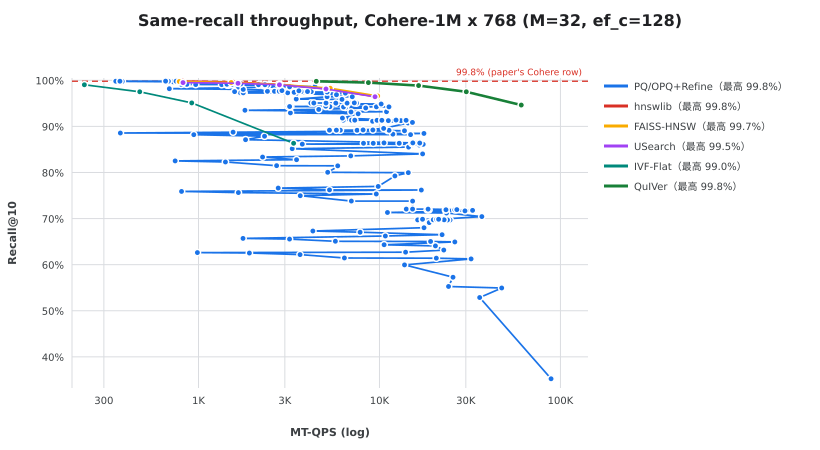

# 5. Applicability Is Not Competitiveness

> All competitor arms are measured on the same machine, on the same data and the same ground truth as the
> QuIVer arm they are compared against; every QuIVer point is a multi-arm run in one process. One same-family
> arm carries a documented protocol correction (§5.6b).

## 5.1 The question a deployer actually asks

Table 11 and Figure 3 of the paper present a four-tier "applicability gradient" — *collapse* (< 15 % R@10),
*usable* (32–42 %), *moderate* (71–78 %), *competitive* (> 88 %) — keyed to **absolute Recall@10 at ef = 64**.
The tier names, however, invite a deployment reading ("moderate", "competitive") that absolute recall alone
cannot support. A deployer's question is:

> at the recall level where I need to operate, is this index faster than the alternatives — or is it at
> least able to reach that recall level at all?

We answer that question for each tier by measuring the same base/query set with four independent CPU
implementations.

## 5.2 Method: a criterion that does not depend on QPS

For each dataset we compare QuIVer's **ceiling** — R@10 at the largest search beam we sweep (ef_s = 1024) —
against each baseline's **lowest operating point** (ef = 64).

If the ceiling is *below* the baseline's lowest point, the two recall-vs-QPS curves **cannot intersect**: at
every recall the baseline reaches, it exists; at every recall QuIVer reaches, it is slower *or* less accurate.
The verdict is then independent of any throughput measurement, which matters because our machine cannot
exercise the AVX-512 path QuIVer is built around (§4.2). Competitors: hnswlib and FAISS-HNSW (graph), USearch
(graph), FAISS-IVF-Flat (inverted file), plus an exact scan.

## 5.3 Result: three of the four tiers are dominated

| Tier (paper) | Representative | QuIVer ceiling (ef_s = 1024) | Strongest baseline at ef = 64 | Curves intersect? |
|---|---|---|---|---|
| **competitive** (> 88 %) | Cohere-1M (768-d) | 99.78 % | hnswlib **99.84 %** @ 741 MT-QPS | **yes** — QuIVer **4.6–5.0×** faster at matched recall |
| **moderate** (71–78 %) | Wolt-CLIP-1M (512-d) | **86.81 %** | hnswlib **87.86 %** @ 19,606 MT-QPS | **no** — ceiling below the baseline's *lowest* point |
| **usable** (32–42 %) | GloVe-100 (100-d) | **71.69 %** | hnswlib **82.05 %** @ 36,047 MT-QPS | **no** |
| **collapse** (< 15 %) | SIFT-128 (128-d) | **47.21 %** | hnswlib **97.46 %** @ 45,118 MT-QPS | **no** |
| collapse | GIST-960 (960-d) | 4.38 % | *not measured* (expected dominated) | — |
| collapse | Random-Sphere (768-d) | 6.46 % | *not measured* (expected dominated) | — |

Only the top tier is winnable. In the other three measured tiers the gap is not a matter of tuning the search
beam: QuIVer cannot reach the recall region where the baselines start, and the deficit grows with dataset
difficulty (0.3 pp on Wolt-CLIP, 10.4 pp on GloVe-100, 50 pp on SIFT-128).

**Caveat on Wolt-CLIP.** That dataset is tie-limited: an exact float32 scan reproduces only **90.09 %** of the
shipped ground truth (see §5.4), so both methods are compressed against the same ceiling and the margin
between them is small in absolute terms. The domination verdict does not depend on it (86.81 % < 87.86 % is a
comparison of the same GT), but the *ranking* is what matters here, not the absolute distance from 100 %.

## 5.4 A protocol-level caveat worth carrying forward: the tie floor

The exact scan is a required control, and it is not always 100 %:

| dataset | exact scan R@10 | implication |
|---|---|---|
| Cohere-1M, GloVe-100, GloVe-100 (centered) | **100.00 %** | GT self-consistent |
| GIST-960 (centered) | 99.93 % | fine |
| SIFT-128 | 99.94 % | fine |
| **Wolt-CLIP-1M** | **90.09 %** | ~10 pp of the GT is tie-degenerate ⇒ recall values for this dataset must never be compared across datasets |

## 5.5 Implication

The deployable region of BQ-native graph indexing is **narrower than the published applicability gradient
suggests**: the paper's "moderate" and "usable" tiers describe *absolute* recall, while as a deployment
proposition they are dominated by a baseline that was already available.

This is the question §6–§8 take up: the tiers are not negotiated — the two lower ones are *mechanistically*
explainable (§6), and §7–§8 ask whether the boundary can be moved rather than merely described.

## 5.6 Is that boundary a property of the data, or of the code?

§5.3 establishes *that* the lower tiers are unreachable; it does not say *why*. The paper's presentation — a
per-dataset table of R@10 — reads as a property of the **dataset**. Two further arms and one axis sweep, all on
the same data with the same ground truth, say otherwise — and one arm forced a protocol correction we document
in (b).

**(a) A baseline class the table omits.** Table 11 contains no quantizer baseline, although the paper's own
§5.3 list names four (DiskANN PQ+FP, SSD, FAISS OPQ+IVF-PQ+Refine, FAISS IVF+RaBitQ+Refine). We ran the
FAISS ones as closely as our platform allows (§10.3/L14 records the configuration differences):

| Task (same data + GT, same machine, 32 threads) | QuIVer, best | OPQ+IVF-PQ+Refine | Verdict |
|---|---|---|---|
| Cohere-1M (768-d; competitive tier) | **99.78 %** @ 8,684 | 99.82 % @ 2,330 | **QuIVer wins**: 3.7× faster at ≥ 99.0 % recall |
| Wolt-CLIP-1M, after centring | 89.05 % @ 9,788 | **89.66 %** @ 3,809 | **Tie-bound**: every index lands ≈ 90 % under a **96.1 %** exact-scan ceiling (L6) |
| GloVe-100, after centring | 93.32 % @ 11,675 | **96.61 %** @ 4,990 | **Split**: PQ higher recall, QuIVer higher QPS |
| GIST-960, after centring | 82.77 % (centred) → **88.99 %** (rotated) | **98.99 %** @ 3,242 | **PQ wins**: more accurate **and** never collapsed |
| SIFT-128, after centring | 84.57 % (centred) → **95.74 %** (rotated) | **99.94 %** @ 2,151 | **PQ wins**: more accurate **and** never collapsed |
| `coco_nomic` (VIBE; outside Table 11) | **0.21 %** (0.70 % rotated) | **98.42 %** @ 7,771 | **PQ wins**: does not collapse at all |

On all **six** cells above, a PQ/OPQ pipeline with the *same* f32 re-ranking never collapses — the hardest
cases included: `gist960c` (39.74 % at `ef=64` after centring), `sift128c` (30.16 %), `coco_nomic` (0.21 %).
The published boundary is therefore a property of **the 2-bit sign–magnitude code**, not of quantization in
general and not of the data. The price is memory: a refined PQ index must keep the f32 copy it re-ranks
against, ≈ **3.16 GiB** for 1 M × 768, against QuIVer's **675 MiB** (§11.3a). "Cheap memory" and "high recall"
are a trade-off *for PQ*; BQ-native is the arm that gives up neither — which is the honest version of the
BQ-native value proposition, and the one §8.7 quantifies. Figure 5 shows the same-recall comparison on Cohere.

**(b) The same-family arm, and the protocol trap that faked its verdict.** The paper's list also names its own
family — "FAISS IVF+RaBitQ+Refine" — so we ran `IndexIVFRaBitQ` + `IndexRefineFlat` (f32 re-ranking) on
Cohere-1M alongside an exact IVF-Flat arm on the same nprobe grid. The first run produced a result that is
*impossible* if both arms are measured correctly: under the same ground truth, the exact-coarse arm saturated
at **34.9 %** while the candidate-pool arm reached **59.8–60.2 %** — although every refine result re-ranks a
subset of what IVF-Flat compares exactly, so IVF-Flat must be the upper bound. We did not publish either
number, and diagnosed before writing. Three checks resolved it (all artifacts ship with this report):

1. **The parameters were reaching the index.** `ParameterSpace().set_index_parameter(wrapper, "nprobe", x)` is
   verified to land on the wrapped base (`base.nprobe = 256` after the call). The one real parameter bug was
   `k_factor`: it is *not* settable through `ParameterSpace` in faiss 1.15, and the pre-fix script's
   `except: pass` silently kept the default (`k_factor = 1`) — the tell was that the earlier sweep printed
   *identical* recalls for every `k_factor` value, with only the small nprobe slope. The fixed script assigns
   directly and records the **effective** values (`eff_nprobe`, `eff_k_factor`) in every artifact row.
2. **FAISS behaves as theory demands on a controlled task.** On synthetic data with a self-consistent GT,
   larger `k_factor` monotonically improves the refine arm (19.3 → 44.5 → 46.1 %), and at `k_factor = 200` it
   *equals* the exact IVF-Flat control at the same nprobe (46.05 % = 46.05 %). The inversion is not a library
   defect.
3. **The ground truth does not match the on-disk vectors.** The shipped Cohere GT is reproduced exactly by
   inner product on **normalised** vectors (10.0/10 overlap on six queries) and cannot be reproduced by
   raw-vector search (raw-IP 4.2/10; the f32 files carry ‖x‖ ≈ 13.8 — Cohere is the one dataset our preparation
   pipeline left un-normalised, while its GT is cosine). Every raw-vector arm is scored against the wrong
   objective — and the two sub-arms fail *differently* against it: a small candidate pool follows the RaBitQ
   code's direction-based estimate (which happens to track cosine better, hence "60 %"), while a larger pool
   lets the f32 re-ranking drag the result toward the raw-IP answer (hence 35 %, converging to the exact arm's
   34.8 %).

**Corrected measurement (normalised vectors, same GT, 32 threads, idle machine):**

| Arm | nprobe = 64 | 256 | 512 | 1024 (full scan) |
|---|---|---|---|---|
| IVF-Flat, exact coarse (upper bound) | 97.38 % @ 279 | 99.82 % @ 72 | 99.98 % @ 37 | **100.00 %** @ 21 |
| RaBitQ+Refine, `k_factor = 1` (default) | 78.03 % @ 4,656 | 78.88 % @ 1,272 | 78.90 % @ 673 | 78.91 % @ 369 |
| RaBitQ+Refine, `k_factor = 20` | 97.37 % @ 4,364 | 99.79 % @ 1,268 | 99.95 % @ 673 | 99.97 % @ 380 |
| RaBitQ+Refine, `k_factor = 200` | 97.38 % @ 2,885 | 99.82 % @ 1,087 | 99.98 % @ 611 | **100.00 %** @ 360 |

Three readings. (i) **The inversion is gone**: at every nprobe the candidate-pool arm is ≤ the exact arm and
ties it once the pool covers the probed lists — the family ranks exactly as theory requires. (ii) A
"same-family" arm must **document its effective parameters**: the default `k_factor = 1` sits ~19 pp below the
tuned point at the same nprobe, and pre-fix artifacts that hide it are not baselines. (iii) As a deployment
datum the family is real: at ≈ 97.4 % recall the refine arm recovers the exact arm's recall at **≈ 15×** its QPS
(4,364 vs 279), and at ≈ 99.8 % it is still ≈ 15× (1,087 vs 72). The retracted raw-vector pair is kept in the
artifact store, flagged, as the record of the trap; a normalised FastScan+SQ8 spot check from the same family
reaches 98.99 % at nprobe = 256 / `k_factor` = 20 (recall-only log).

**(c) The third axis: bit capacity, not data difficulty.** Holding the code family fixed and varying only
bits per dimension (§6.5) moves every one of the four "collapse" datasets from ≤ 3.6 % (1–2 bit) to
**≥ 94.6 % (4 bit)** on the same task. So "collapse" is mostly *this* 2-bit allocation, not the distribution:
the axis the paper varies is the dataset, while the axis that moves the outcome is the code's bit budget.
